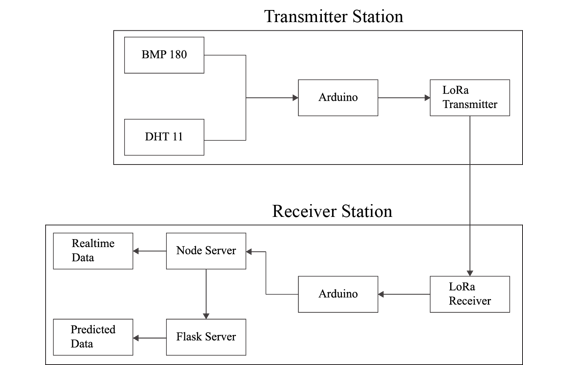

# Weather Forecasting using LoRa and  Machine Learning

## Introduction

Weather forecasting using LoRa is a simplified and cost effective method for predicting weather. We will be using it to predict real time weather condition at high altitudes.

## Problem Statement&#x20;

Done using Satellite Communication&#x20;

* Expensive&#x20;
* Limited Coverage&#x20;
* Power Limitation&#x20;
* Latency&#x20;
* Signal Degradation

Cellular Communication (3G, 4G) not possible

## Objectives

1. To develop LoRa communication system for real time weather data transmission.&#x20;
2. To design and implement prototype system for real time weather forecasting.&#x20;
3. To investigate the use of machine learning algorithms for weather prediction.

## Literature Review

* Machine Learning can perform better than the traditional mathematical models in the scope of weather prediction over time through research into related work coupled with our experimentation.\[5]&#x20;
* Recently, there has been growing interest in the possibility of using neural networks for both weather forecasting and the generation of climate datasets.\[10]&#x20;
* LoRa can be considered as a good candidate in solving the complexity of the problems in the development of IoT in the next future.\[2]
* &#x20;The experiment with LoRa transmission has shown that the LoRa technology is very suitable for the air pollution system especially in long range transmission compared to other wireless transmission techniques.\[11]

## Methodology

Weather data from BMP 180 and DHT 11 sensor are transmitted from transmitter to receiver section using LoRa. Arduino at receiver station sends the sensor data to the Node Server. Node server displays the live weather data using chart.js. Node servers calls API to Flask server for weather prediction. Flask server calls machine learning model when user enters input parameters for weather prediction.

### System Block Diagram

.png>)

### System Activity Diagram

.png>)

### Node Activity Diagram

 (1).png>)

### Flask Activity Diagram

 (1).png>)

### Circuit Layout

.png>)

### Machine Learning Pipeline

a. Data collection for model training.

b. Data filtering

.png>)

#### Feature Engineering

Transforming raw data into a format that is more suitable for machine learning algorithms to extract meaningful patterns and make accurate predictions.

FIG: Humidity

.png>)

FIG: Temperature&#x20;

.png>)

FIG: Pressure

#### Selection of Model

XGBoost algorithm was used to train the model due to following reasons:

1. It has high prediction performance which is designed to handle complex, non-linear relationships in data and can capture subtle patterns that may be missed by other algorithms
2. It can be used for both classification and regression tasks.
3. It provides valuable insights into feature importance. It calculates feature importance scores based on the number of times a feature is used to split the data across all the boosting trees.
4. It is highly optimized and offers fast execution speed.
5. XGBoost has built-in capabilities to handle missing data. It can learn how to handle missing values by making informed decisions during the tree-building process.
6. The selected Model is trained using the collected data. 80% of the data is used for training and the remaining 20% of data is used for testing.
7. Root Mean Square Error calculation for the following parameters.png>)&#x20;

## Result

#### Live Weather Report

.png>)

#### Weather Prediction

.png>)

## Future Enhancement

* Machine learning can be improved using more datasets and better algorithms.
* The LoRa’s data can be collected in the database to use it as a training dataset for more accurate weather prediction.
* The project can be expanded to include more atmospheric data to predict rain and chances of avalanches in mountainous terrain.

## References

* \[1] Singh, D.K., Sobti, R., Jain, A., Malik, P.K., Le, D.-N.: LoRa based intelligent soil and weather condition monitoring with internet of things for precision agriculture in smart cities. IET Commun. 16, 604– 618 (2022).&#x20;
* \[2] I. T. Ali and R. F. Sari, "Research Opportunities of LoRaWAN for Internet of Things Implementation," 2018 2nd International Conference on Applied Electromagnetic Technology (AEMT), Lombok, Indonesia, 2018, pp. 61-66, doi: 10.1109/AEMT.2018.8572427.
* \[3] Pozdnoukhov, A., Purves, R., & Kanevski, M. (2008). Applying machine learning methods to avalanche forecasting. Annals of Glaciology, 49, 107-113. doi:10.3189/172756408787814870
* \[4] Augustin, A., Yi, J., Clausen, T. and Townsley, W.M. 2016. A Study of LoRa: Long Range \&amp; Low Power Networks for the Internet of Things. Sensors. 16, 9 (Sep. 2016), 1466. DOI:https://doi.org/10.3390/s16091466.
* \[5] B. Quinn and E. Abdelfattah, "Machine Learning Meteorologist Can Predict Rain," 2019 IEEE 10th Annual Ubiquitous Computing, Electronics & Mobile Communication Conference (UEMCON), New York, NY, USA, 2019, pp. 0057-0062, doi: 10.1109/UEMCON47517.2019.8992997.
* \[6] Goldoni, E., Prando, L., Vizziello, A., Savazzi, P. and Gamba, P. 2019. Experimental data set analysis of RSSI-based indoor and outdoor localization in LoRa networks. Internet Technology Letters. 2, 1 (Jan. 2019), e75. DOI:https://doi.org/10.1002/itl2.75.
* \[7] Jitcha Shivang, S.S Sridhar, “WEATHER PREDICTION FOR INDIAN LOCATION USING MACHINE LEARNING”, International Journal of Pure and Applied Mathematics Volume 118 No. 22 2018,1945-1949 ISSN: 1314-3395 (on-line version).
* \[8] T. A. Team, “Nano,” Arduino Documentation, [https://docs.arduino.cc/hardware](https://docs.arduino.cc/hardware).
* \[9] D. Hudgeon and R. Nichol, “Machine Learning for Business: Using amazon sagemaker and Jupyter,” Amazon, [https://docs.aws.amazon.com/sagemaker/latest/dg/xgboost-HowItWorks.html](https://docs.aws.amazon.com/sagemaker/latest/dg/xgboost-HowItWorks.html).
* \[10] S. Scher and G. Messori, “Weather and climate forecasting with neural networks: Using general circulation models (gcms) with different complexity as a study ground,” Geoscientific Model Development, [https://doi.org/10.5194/gmd-12-2797-2019](https://doi.org/10.5194/gmd-12-2797-2019).
* \[11] N. A. A. Husein, A. H. A. Rahman, and D. P. Dahnil, “Evaluation of lora-based Air Pollution Monitoring System,” International Journal of Advanced Computer Science and Applications (IJACSA), http://dx.doi.org/10.14569/IJACSA.2019.0100753 (accessed May 21, 2023).


Presentation


